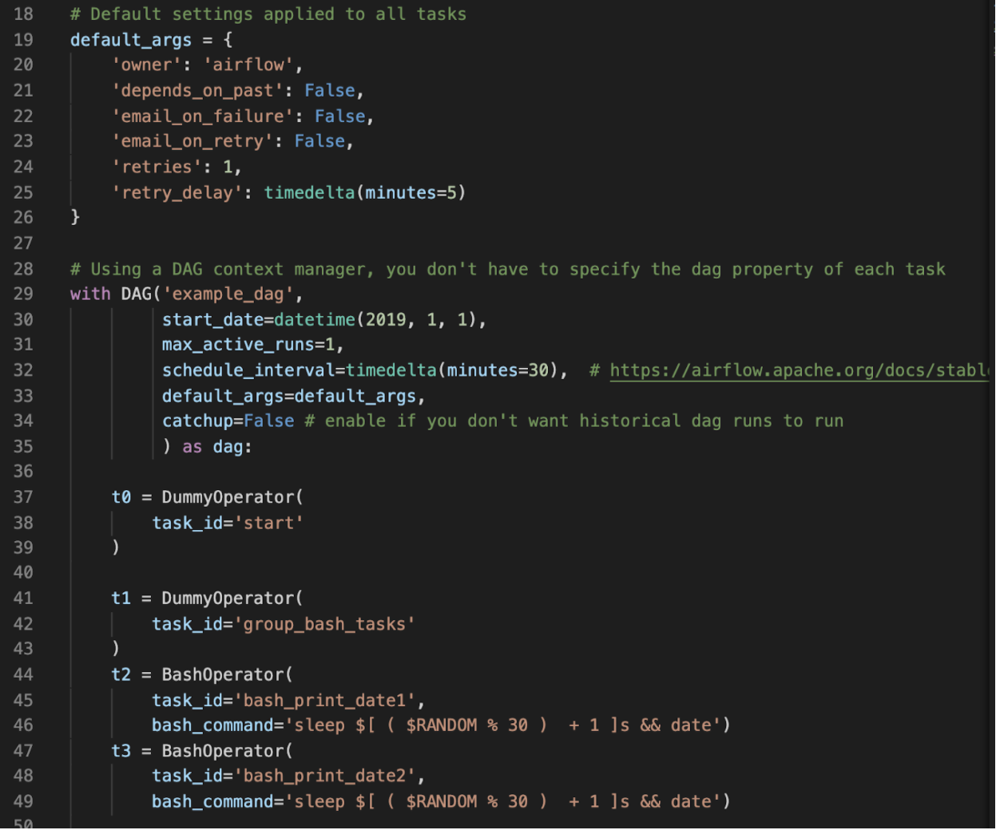
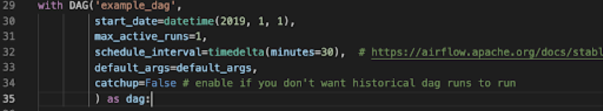
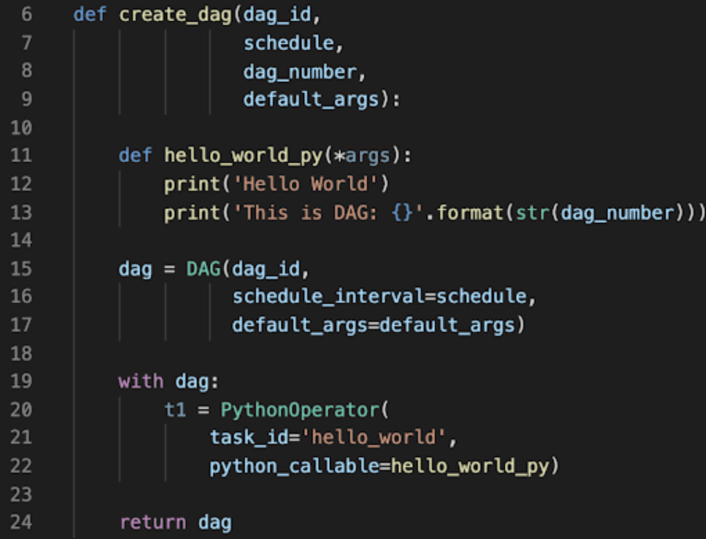
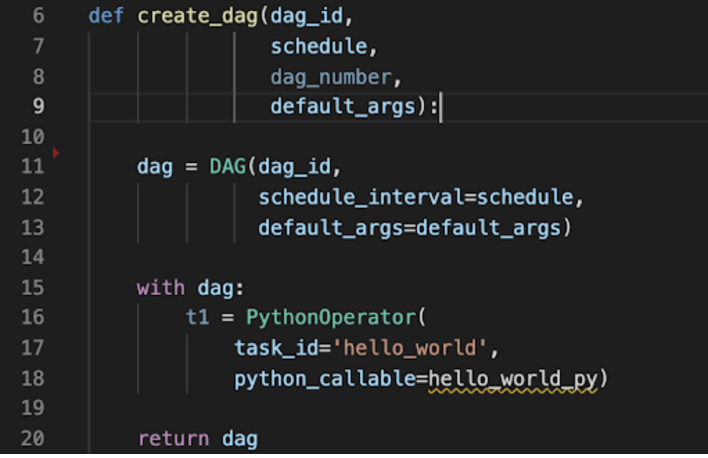
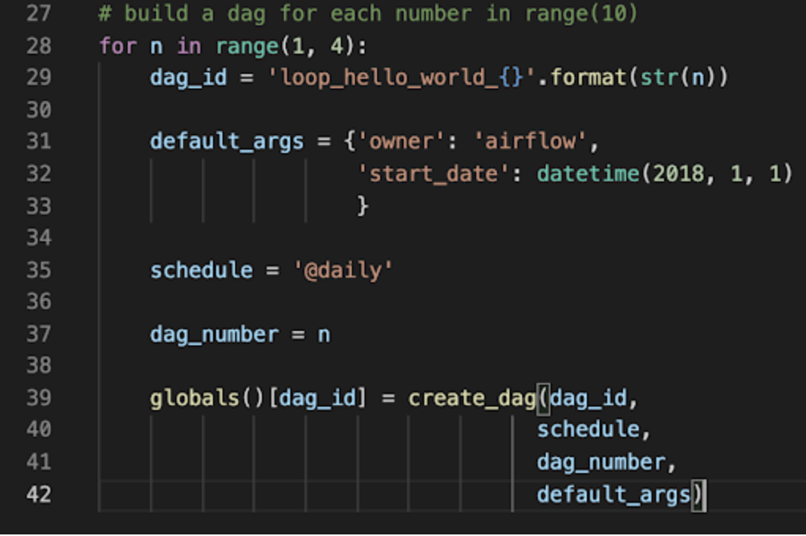
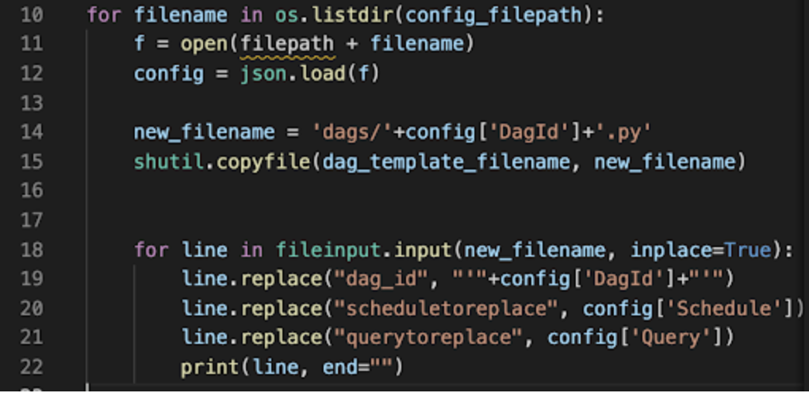
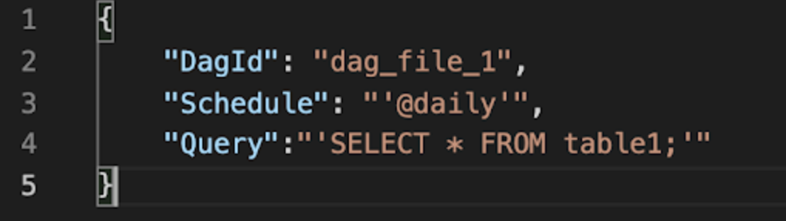
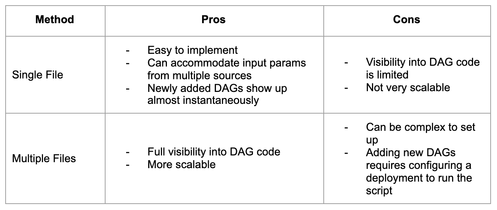
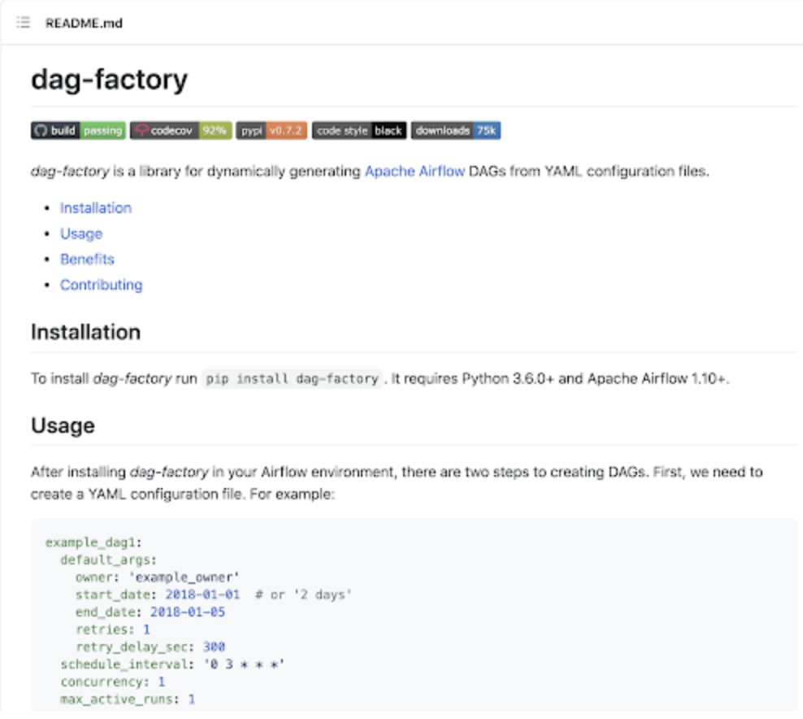

<iframe src="https://fast.wistia.net/embed/iframe/nau4xjg941" title="Dynamic Dags Video" allow="autoplay; fullscreen" allowtransparency="true" frameborder="0" scrolling="no" class="wistia_embed" name="wistia_embed" allowfullscreen msallowfullscreen width="100%" height="450"></iframe>

The simplest way of creating an Airflow DAG is to write it as a static Python file. However, sometimes manually writing DAGs isn't practical. 

Maybe you have hundreds or thousands of DAGs that do similar things, with just a parameter changing between them. Or maybe you need a set of DAGs to load tables, but don't want to manually update DAGs every time those tables change. 

In these cases, and others, it can make more sense to dynamically generate DAGs. Because everything in Airflow is code, you can dynamically generate DAGs using Python alone. 

In this webinar, we'll talk about when you might want to dynamically generate your DAGs, show a couple of methods for doing so, and discuss problems that can arise when implementing dynamic generation at scale.

In this webinar we cover:
* How Airflow identifies a DAG
* Use cases for dynamically generating DAGs
* Commonly used methods for dynamic generation
* Pitfalls and common issues with dynamic generation

## Generating DAGs - The Static Way 
Most people who have used Airflow are familiar with defining DAGs statically.

You create a Python file, instantiate your DAG, and define your tasks.

## But What Actually Makes a DAG?
* Airflow executes all Python code in the `DAG_FOLDER` and loads any `DAG` object found in `globals()`
* This means that any Python code that generates a `DAG` object can be used to create DAGs

## A dynamically generated DAG is created when each parsing of the DAG file could create different results.  
**Why is this useful?**
Dynamically generating DAGs can be helpful when you have DAGs that follow a similar pattern, and:
* Want to automate migration from a legacy system to Airflow
* Have only a parameter changing between DAGs
* Have DAGs that are dependent on the changing structure of a source system
* Want to institute standards within DAGs across your team or organization

## Ways to Dynamically Generate DAGs: Single File
Create a Python script that lives in your DAG_FOLDER that generates DAG objects.

You may have a function that creates the DAG based on some parameters, and then a loop that calls that function for each input.

Those parameters may come from:
* Within the file
* An Airflow variable
* Airflow connections
* Etc.

## Ways to Dynamically Generate DAGs: Multiple Files

Create a Python script (or other script) that actually generates DAG .py files, which are then loaded into your Airflow environment.

This is most straightforward if you are parameterizing the same DAG structure, and want to automatically read those params from YAML, Json, etc.

## Pros and Cons

## Scalability 
Any code in the DAG_FOLDER will be executed on every Scheduler heartbeat. Methods where that code is dynamically generating DAGs, such as the single-file method, are more likely to cause performance issues at scale.

If DAG parsing time > Scheduler heartbeat interval, the scheduler can get locked up and tasks won't be executed.

Community Tools
A notable tool for dynamically creating DAGs from the community is dag-factory. [dag-factory](https://github.com/ajbosco/dag-factory) is an open source Python library for dynamically generating Airflow DAGs from YAML files.

https://github.com/ajbosco/dag-factory

## Code Examples
This repo contains an Astronomer project with multiple examples showing how to dynamically generate DAGs in Airflow.

https://github.com/astronomer/dynamic-dags-tutorial 

## Getting Apache Airflow Certified
Join the 1000’s of other data engineers who have received the  [Astronomer Certification](https://www.astronomer.io/certification) for Apache Airflow Fundamentals. This exam assesses an understanding of the basics of the Airflow architecture and the ability to create basic data pipelines for scheduling and monitoring tasks.
