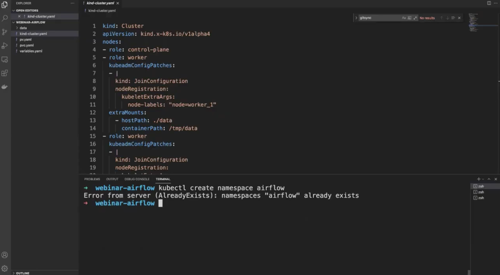
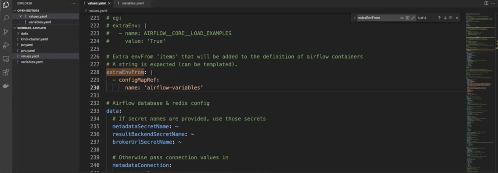

<iframe src="https://fast.wistia.net/embed/iframe/gviwd9gp2c" title="Dynamic Dags Video" allow="autoplay; fullscreen" allowtransparency="true" frameborder="0" scrolling="no" class="wistia_embed" name="wistia_embed" allowfullscreen msallowfullscreen width="100%" height="450"></iframe>

The official helm chart of Apache Airflow is out! The days of wondering what Helm Chart to use in production are over.

Now you can safely deploy Airflow in the production environment using an official chart maintained and tested by Airflow PMC members as well as the community.

**Why is this great news?**

* If Airflow gets updated, so does your Helm Chart
* You can quickly run some experiments with new features of Airflow, for example KEDA
* You can easily run local experiments

At the end of the webinar, you will have a fully functional Airflow instance deployed with the Official Helm Chart and running within a Kubernetes cluster locally.

In this webinar we’ll show you how to:
* Create a Kubernetes cluster with KinD in local
* Deploy Airflow in a few seconds with the Official Helm Chart
* Discover the first parameters to configure in the Helm Chart
* Synchronize your DAGs with a Git repository
* (BONUS!) Get your task’s logs

## Step 1: Create the local Kubernetes cluster

> Note: *you need to have Docker, Docker Composer, kubectl, and Kind installed.*

1. Open the `kind-cluster.yaml` file — here you define your cluster. 

You can see here different `worker` nodes. Each worker node you can configure and specify.

2. Type the command `kind create cluster --name airflow-cluster --config kind-cluster.yaml`

Now you have a Kubernetes cluster!

## Step 2: Deploy Apache Airflow with Helm Chart

1.Create namespace: `kubectl create namespace airflow`

2. Type `kubectl get ns`

This is the namespace in which you’re going to deploy your Airflow instance.

3. Add the official repository of Helm Chart by typing `helm repo add apache-airflow https://airflow.apache.org`

4. To get the latest version of your Chart, type `helm repo update`

5. You can find your chart by typing `helm search repo airflow`

6. Deploy your Helm Chart type: `helm install airflow apache-airflow/airflow --namespace airflow --debug --timeout 10m0s`

7. Once it’s deployed type `helm ls -n airflow` to see the Helm release that corresponds to your Airflow instance

You can see the number of the revision—currently it’s 1. In the future, if you make a mistake and want to go back to your previous version you can do that easily by using `helm rollback airflow <Revision Number>`.

You should end up with:

8. Now it’s time to configure your UI. Type `kubectl port-forward svc/airflow-webserver 8080:8080 -n airflow` to bind the port 8080 to your machine

9. Go to the web browser, type localhost:8080 to open a login window for Apache Airflow. By default both user and password name is “admin”. After logging in you should be able to see the Airflow UI:

## Step 3: Configure Helm Chart
1. Upgrade your Airflow instance to the latest version

Open the new terminal and type `helm show values apache-airflow/airflow > values.yaml` and wait a bit to get the configuration file.

2. Once it’s loaded, modify your Airflow instance. First, modify the Airflow version. Instead 2.0.0, change it to 2.1.0:

3. Next, modify the executor to KubernetesExecutor:

4. Add a configMap too, with the name: `airflow-variables` (it’s great for keeping your variables when Airflow gets restarted or updated)

5. Upload the ConfigMap to your Kubernetes Cluster: `kubectl apply -f variables.yaml`

6. Upgrade Apache Airflow instance with `helm upgrade --install airflow apache-airflow/airflow -n airflow -f values.yaml --debug`

And deploy!

__To learn how to add your own [Airflow providers click here](https://www.astronomer.io/blog/airflow-providers)! For the purpose of this webinar we used the [GreatExpectations provider](https://registry.astronomer.io/providers/great-expectations/modules/greatexpectationsoperator).__

## Step 4: How to sync DAGs

1. Go to your private repository and create an SSH key (if you don’t have one)
2. Go to the settings of the repository. Then deploy your public key in the “Deploy keys” section (don’t select “Allow write access”). You should end up with something like this:

3. In the terminal you need to configure your chart with `gitSync`

Enable it by typing `True`

Then in the repository copy the SSH link and go back to the terminal and paste the link in the `repo`. Before the pasted link type “ssh://” and change “:” to “/”.

So, for example we used the SSH link `git@github.com:marclamberti/airflow-2-dags.git` and changed it to: `ssh://git@github.com/marclamberti/airflow-2-dags.git`.

Also, change the `branch` to `main` and delete the `tests/dags` value in `subPath`.

4. As you need to give your private key you want to use a Secret for additional security.

Type `kubectl create secret generic airflow-ssh-git-secret --from-file=gitSshKey=`and point to where your private key is. In our example it looks like this: `kubectl create secret generic airflow-ssh-git-secret --from-file=gitSshKey=`**`Users/marclamberti/.ssh/id_rsa -n airflow`**.

Check if it’s been deployed successfully.

5. Go back to the Airflow UI and refresh. Your DAGs should appear there in 5 minutes. Once they are loaded any future modifications will be uploaded every 60 seconds

Now you have a fully functional Airflow environment!
## BONUS: Get your task’s logs

1. Create a folder data/ where your cluster file is.
2. Create the Persistent Volume in your Kubernetes cluster with `kubectl apply -f pv.yaml`
3. Create the Persistent Volume Claim in your Kubernetes cluster with `kubectl apply -f pvc.yaml`
4. Change values.yaml under the section logs like this:

5. Upgrade your chart with `helm upgrade --install airflow apache-airflow/airflow -n airflow -f values.yaml --debug`
6. Trigger your DAG

Enjoy 😁
